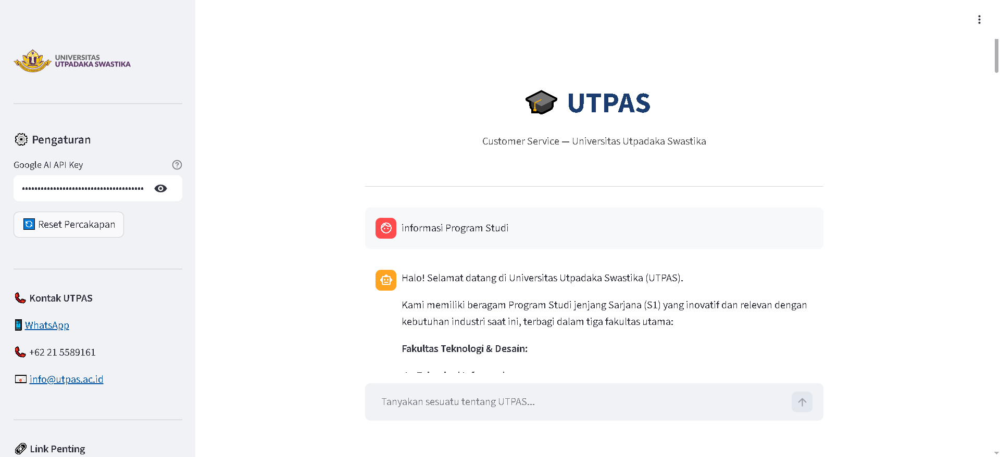

# 🎓 Chatbot Customer Service — Universitas Utpadaka Swastika (UTPAS)

Chatbot customer service berbasis **AI (Gemini)** untuk website [utpas.ac.id](https://utpas.ac.id), dibangun menggunakan **Streamlit** dan dapat dijalankan langsung di **Google Colab** via ngrok tunnel.



---

## ✨ Fitur

- 💬 Chatbot berbasis Gemini AI dengan konteks percakapan
- 🎓 Pengetahuan lengkap seputar UTPAS (prodi, beasiswa, pendaftaran, kontak, lokasi)
- 👋 Pesan selamat datang otomatis saat chatbot dibuka
- 📋 Sidebar informatif berisi kontak, link pendaftaran, e-learning, dan pengumuman
- 🔄 Tombol reset percakapan
- ⚠️ Error handling dengan saran menghubungi tim UTPAS
- 🎨 Tampilan branded sesuai identitas UTPAS

---

## 🗂️ Struktur Repositori

```
chatbot_streamlit/
├── CustomerService_Chatbot.ipynb   # Notebook Google Colab (end-to-end setup + jalankan app)
├── streamlit_app.py                # Source code chatbot Streamlit
└── README.md
```

---

## 🚀 Cara Menjalankan (Google Colab)

### Prasyarat

Sebelum memulai, siapkan dua hal berikut:

| Kebutuhan | Cara Mendapatkan |
|---|---|
| **ngrok Auth Token** | Daftar gratis di [ngrok.com](https://ngrok.com) → Dashboard → Your Authtoken |
| **Google AI API Key** | Buka [aistudio.google.com](https://aistudio.google.com) → Get API Key → Create API Key |

### Langkah-langkah

1. **Buka notebook** `CustomerService_Chatbot.ipynb` di Google Colab

2. **Simpan ngrok token** di Colab Secrets:
   - Klik ikon 🔑 di sidebar kiri Colab
   - Tambahkan secret dengan nama `NGROK_TOKEN`
   - Isi dengan Auth Token dari dashboard ngrok

3. **Jalankan semua cell** secara berurutan:
   - Cell 1: Install library
   - Cell 2: Konfigurasi ngrok
   - Cell 3: Fungsi helper
   - Cell 4: Tulis file chatbot
   - Cell 5: Jalankan app → URL publik akan muncul

4. **Buka URL** yang muncul di output Cell 5

5. **Masukkan Google AI API Key** di sidebar kiri aplikasi

6. Mulai chat! 🎉

---

## 💻 Menjalankan Secara Lokal

Jika ingin menjalankan tanpa Colab:

```bash
# Clone repo
git clone https://github.com/baguspam/chatbot_streamlit.git
cd chatbot_streamlit

# Install dependensi
pip install streamlit google-genai

# Jalankan
streamlit run streamlit_app.py
```

Buka browser di `http://localhost:8501`, lalu masukkan Google AI API Key di sidebar.

---

## 🛠️ Tech Stack

| Teknologi | Kegunaan |
|---|---|
| [Streamlit](https://streamlit.io) | Framework web app Python |
| [Google Gemini API](https://aistudio.google.com) | Model AI (gemini-2.5-flash) |
| [google-genai](https://pypi.org/project/google-genai/) | SDK Python untuk Gemini |
| [pyngrok](https://pyngrok.readthedocs.io) | Tunnel publik dari Colab |
| [Google Colab](https://colab.research.google.com) | Environment runtime cloud |

---

## 🤖 Contoh Pertanyaan

Coba tanyakan hal-hal berikut kepada chatbot:

- *"Apa saja program studi yang tersedia di UTPAS?"*
- *"Bagaimana cara mendaftar sebagai mahasiswa baru?"*
- *"Beasiswa apa saja yang tersedia?"*
- *"Di mana lokasi kampus UTPAS?"*
- *"Apa perbedaan prodi Sistem Informasi dan Teknologi Informasi?"*
- *"Apakah ada program mahasiswa pindahan?"*
- *"Bagaimana cara menghubungi pihak kampus?"*

---


## 📄 Lisensi

Proyek ini dibuat untuk keperluan edukasi dan demonstrasi.
